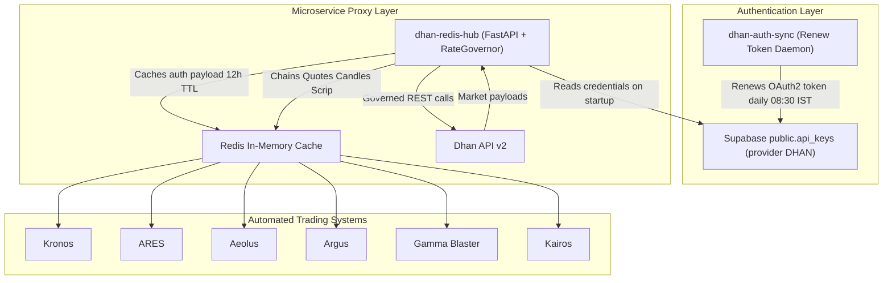

# Dhan Redis Hub — Master System Documentation

> [!abstract] Single source of truth
> This note consolidates **everything** for `dhan-redis-hub`: the PRD, the architecture spec, ADR-001, the full module/API reference, the environment matrix, the CI/CD pipeline, the migration guide + checklist, the version history, and the known gaps.
> It supersedes the previously scattered vault notes (`Trading Methodology/Dhan Redis Hub Migration Guide`) and mirrors the repo's `docs/` folder at `~/Documents/Work/dhan-redis-hub/docs/`.

---

## 1. Executive Summary

### The Problem

During Indian market hours (09:15 – 15:30 IST) multiple automated trading engines run in parallel, each holding the *same* Dhan account credentials:

- [[Projects/Kronos/00_Home|Kronos]] — Multi-symbol scanner & options strategy executor
- [[Projects/Ares/Deployment|ARES]] — Adaptive reversal & breakout entry signal engine
- [[Projects/Aeolus/01_Architecture|Aeolus]] — Volatility & trend momentum system
- [[Projects/Argus/00_Home|Argus]] — Institutional orderflow & volume profile tracker
- [[Projects/Gamma Blaster/Gamma Blaster Index|Gamma Blaster]] — Options delta & gamma surge detector
- **Stock Screener** — Real-time NSE universe screener
- [[Projects/Kairos|Kairos]] — Options pricing & Greeks engine

Because each bot operates without awareness of the others, aggregate request volume to `api.dhan.co/v2` breaches Dhan's per-endpoint rate limits (~1 req/sec per category), producing **HTTP 429 Too Many Requests**. Symptoms: dropped signals, failed executions, degraded latency (1,500–4,000 ms), and rate-limit bans.

### The Solution

`dhan-redis-hub` is a **single-writer FastAPI microservice with an embedded Redis cache**, deployed to Fly.io Mumbai (`bom`).

1. Only `dhan-redis-hub` talks to `api.dhan.co`. Bots MUST NOT call Dhan directly.
2. All outbound calls pass through an async token-bucket `RateGovernor` with exponential backoff on 429.
3. Responses (option chains, expiry lists, quotes, candles, scrip master) are cached in Redis with short TTLs.
4. Live ticks from the Dhan WebSocket feed broadcast over Redis Pub/Sub (`dhan:ticks:<security_id>`).
5. Bots consume via the lightweight `DhanRedisClient` — Redis read on hit, HTTP proxy on miss.

### Success Metrics (from PRD)

| Metric | Target |
|---|---|
| 429 rate-limit errors across all bots | **Zero** |
| Cache hit ratio (NIFTY/BANKNIFTY chains + quotes, market hours) | **> 95%** |
| Redis cache-hit latency | **< 2 ms** |
| Uptime during market hours (09:00 – 16:00 IST) | **99.9%** |

---

## 2. Deployment Coordinates

| Item | Value |
|---|---|
| Repo | `~/Documents/Work/dhan-redis-hub` |
| Production URL | `https://dhan-redis-hub.fly.dev` |
| Fly app / region | `dhan-redis-hub` / `bom` (Mumbai) |
| VM | 512 MB, shared CPU, 1 core |
| Container port | `8080` (uvicorn), Redis embedded on `127.0.0.1:6379` |
| Autoscale | `auto_stop_machines = 'stop'`, `auto_start_machines = true`, `min_machines_running = 0` |
| Current version | **1.4.1** (2026-07-26) |
| Deploy trigger | Push/merge to `main` → GitHub Actions → `flyctl deploy --local-only` |

---

## 3. System Topology

```
+-----------------------------------------------------------------------------------+
|                                  DHAN API v2                                      |
|                       https://api.dhan.co/v2 · wss://api-feed.dhan.co             |
+-----------------------------------------------------------------------------------+
                                         ^
                                         | Governed REST + 1 WebSocket feed
                                         v
+-----------------------------------------------------------------------------------+
|                        dhan-redis-hub (Central Service)                           |
|  ┌──────────────────┐    ┌──────────────────┐    ┌─────────────────────────────┐  |
|  │  auth_sync.py    │    │   governor.py    │    │          poller.py          │  |
|  │ (Supabase Sync)  │    │  (RateGovernor)  │    │ (Chains/Quotes/OHLC/Scrip)  │  |
|  └──────────────────┘    └──────────────────┘    └─────────────────────────────┘  |
|  ┌──────────────────┐    ┌──────────────────┐    ┌─────────────────────────────┐  |
|  │    ws_feed.py    │    │      app.py      │    │         alerts.py           │  |
|  │ (WebSocket Hub)  │    │  (FastAPI Proxy) │    │  (3-Tier Discord Health)    │  |
|  └──────────────────┘    └──────────────────┘    └─────────────────────────────┘  |
+-----------------------------------------------------------------------------------+
                                         | Writes / Publishes
                                         v
+-----------------------------------------------------------------------------------+
|                             REDIS IN-MEMORY CACHE                                 |
|   dhan:auth · dhan:optionchain:* · dhan:expirylist:* · dhan:quote:*                |
|   dhan:candles:* · dhan:scrip_master · PubSub dhan:ticks:*                         |
+-----------------------------------------------------------------------------------+
          ^                          ^                          ^
          │  Redis read (local) / HTTP proxy (remote)           │
          ▼                          ▼                          ▼
┌──────────────────┐       ┌──────────────────┐       ┌──────────────────┐
│   ARES Engine    │       │  Gamma Blaster   │       │  Kronos Engine   │
└──────────────────┘       └──────────────────┘       └──────────────────┘
```

### Authentication Handshake (with `dhan-auth-sync`)



> [!note] Handshake sequence
> 1. `dhan-auth-sync` renews the Dhan OAuth2 access token daily and writes it to Supabase `public.api_keys` where `provider = 'DHAN'`.
> 2. `dhan-redis-hub` reads that row at startup and caches `{client_id, access_token, updated_at}` in Redis key `dhan:auth` with a **12-hour TTL**.
> 3. If `dhan:auth` is missing or expired, `get_valid_auth()` re-syncs from Supabase on demand — **no restart required**.
> 4. If Supabase is unreachable, `auth_sync` falls back to whatever is still cached in `dhan:auth`.

### Read Flow (bot requests an option chain)

```
Client Bot (ARES)        DhanRedisClient          Redis Cache          dhan-redis-hub          Dhan API v2
      │                        │                       │                      │                     │
      │─ get_option_chain() ──>│                       │                      │                     │
      │                        │─ GET dhan:optionchain>│                      │                     │
      │                        │<── Cache HIT (JSON) ──│                      │                     │
      │<── Return (<1 ms) ─────│                       │                      │                     │
      │                        │                       │                      │                     │
      │                        │─ (Cache MISS) POST /optionchain ────────────>│                     │
      │                        │                       │                      │─ RateGovernor wait ─│
      │                        │                       │                      │─ POST /v2/optionchain>
      │                        │                       │                      │<── 200 OK ──────────│
      │                        │                       │<─ SET key with TTL ──│                     │
      │<── Return (~50 ms) ────│<──── Proxy response ──┴──────────────────────│                     │
```

---

## 4. Module Reference

### `config.py` — Pydantic settings singleton

Single `Config(BaseModel)` read entirely from environment variables, exposed as `settings`. Also carries the **default polling universe**:

```python
default_indices = [
    {"symbol": "NIFTY",     "underlying_id": 13, "segment": "IDX_I"},
    {"symbol": "BANKNIFTY", "underlying_id": 25, "segment": "IDX_I"},
    {"symbol": "FINNIFTY",  "underlying_id": 27, "segment": "IDX_I"},
    {"symbol": "SENSEX",  "underlying_id": 12, "segment": "IDX_I"},
]
```

### `governor.py` — `RateGovernor`

In-process async token bucket keyed by endpoint category, guarded by a single `asyncio.Lock`, using `time.monotonic()`.

| Method | Behaviour |
|---|---|
| `wait_for_slot(endpoint_category, min_interval_secs)` | Sleeps until `min_interval_secs` has elapsed since the last call in that category, then stamps the new call time. |
| `handle_429_backoff(retry_count=1, base_backoff_secs=2.0)` | Sleeps `base_backoff × 2^(retry_count-1)` and fires a Discord error alert as a detached task. |

Exported as module-level singleton `rate_governor`.

$$\text{Backoff} = \text{base\_backoff} \times 2^{(\text{attempt} - 1)}$$

Enforced intervals: `optionchain` 1.0 s · `quote` 0.5 s · `candles` 1.0 s · `expirylist` 1.0 s (hard-coded).

### `auth_sync.py` — Supabase credential sync

`sync_dhan_credentials(redis_client) -> dict | None`

- Queries Supabase `api_keys` where `provider = 'DHAN'`, takes row `[0]`.
- Writes `{"client_id", "access_token", "updated_at"}` to `dhan:auth` with `ex=43200` (12 h).
- **Every failure path** (no Supabase config, no row, incomplete row, exception) falls back to the existing cached `dhan:auth` value rather than hard-failing.

### `poller.py` — Fetch + cache layer

All functions are cache-first: Redis `GET` → return on hit; otherwise auth → governor → HTTP → validate → `SET` with TTL.

| Function | Cache Key | TTL |
|---|---|---|
| `get_valid_auth(redis)` | `dhan:auth` (re-syncs if absent) | — |
| `fetch_and_cache_scrip_master(redis)` | `dhan:scrip_master` | 24 h |
| `fetch_and_cache_option_chain(redis, symbol, underlying_scrip, underlying_seg, expiry)` | `dhan:optionchain:{SYMBOL}:{expiry}` | 2 s |
| `fetch_and_cache_expiry_list(redis, symbol, underlying_scrip, underlying_seg)` | `dhan:expirylist:{SYMBOL}` | 12 h |
| `fetch_and_cache_quote(redis, security_id, exchange_segment="NSE_EQ")` | `dhan:quote:{security_id}` | 5 s |
| `fetch_and_cache_candles(redis, security_id, exchange_segment, instrument_type, interval, from_date, to_date)` | `dhan:candles:{id}:{interval}:{from}:{to}` | 15 m intraday / 24 h daily |

Implementation details worth knowing:

- **Scrip master** downloads `https://images.dhan.co/api-data/api-scrip-master.csv` and builds a `{SYMBOL: {security_id, exchange, segment, lot_size}}` map from `SEM_CUSTOM_SYMBOL` / `SEM_TRADING_SYMBOL`.
- **Option chain** is the only endpoint with a **3-attempt retry loop**; on `429` it calls `handle_429_backoff(attempt)` and retries. Payload accepted if the response dict contains `oc`, `data`, `last_price`, or `status == "success"` (broadened in v1.1.0 to survive off-market shapes).
- **Quote** unwraps segment nesting: `data[exchange_segment][str(security_id)]`, falling back to `data[str(security_id)]`. Requires a non-empty dict before caching (v1.1.0 fix).
- **Candles** routes to `charts/intraday` for intervals `1/5/15/30/60` (adding `interval` to the payload) and `charts/historical` otherwise.
- HTTP client timeout is **30 s** everywhere (raised in v1.1.0 for cold option-chain queries).

### `ws_feed.py` — `DhanWebSocketHub`

Single WebSocket connection to `wss://api-feed.dhan.co?version=2&token=…&clientId=…&authType=2`.

- `start()` — reconnect loop with exponential backoff `2 s → 60 s` cap; waits 10 s and retries when no credentials are available. `ping_interval=20`, `ping_timeout=10`.
- `_handle_ws_message(message)` — parses JSON, then on a valid `security_id` + `LTP` writes `dhan:quote:{id}` (5 s TTL) **and** publishes to `dhan:ticks:{id}`.
- `stop()` — flips `self.running = False`.

### `alerts.py` — 3-tier Discord health logging

Driven by `DISCORD_HEALTH_WEBHOOK_URL` (falls back to `DISCORD_WEBHOOK_URL`). All messages are Discord `diff` code blocks, timestamped in IST, and tagged with `FLY_REGION`. Every send is best-effort — a webhook failure logs but never raises.

| Function | Fires on | Content |
|---|---|---|
| `send_startup_alert(redis_connected, auth_synced)` | Service launch | Status (`ONLINE` / `DEGRADED`), Fly region, Redis connectivity, Dhan auth state, Rate Governor interval, IST time |
| `send_error_alert(error_msg, component, cooldown_secs=60)` | Redis disconnects, HTTP 429 backoffs, poller exceptions | Component, error, IST time, remediation hint |
| `send_shutdown_alert(reason)` | SIGTERM / machine restart | `OFFLINE`, region, reason, IST time |

> [!tip] Error coalescing
> `send_error_alert` dedupes on the key `f"{component}:{error_msg}"` with a **60-second cooldown**, so a failure loop can't flood the channel. Expired entries are pruned on every call to keep `_last_error_times` bounded, and the cooldown key is **reset if webhook delivery itself fails** so a genuine alert isn't silently swallowed.

### `app.py` — FastAPI service

Owns the module-level `Redis` client (`decode_responses=True`) and the `DhanWebSocketHub` instance.

**Lifespan (startup):** ping Redis → `sync_dhan_credentials()` → dispatch `send_startup_alert()` → launch `background_universe_poller()` and `ws_hub.start()` as tasks.
**Lifespan (shutdown):** `send_shutdown_alert()` → `ws_hub.stop()` → cancel both tasks.

**`background_universe_poller()`** loops every **2.0 s** over `settings.default_indices`, fetching the expiry list then the option chain for the **nearest expiry** of each index. On exception: logs, fires an error alert, sleeps 5 s, continues.

### HTTP API

| Method | Path | Body | Returns |
|---|---|---|---|
| `GET` | `/` | — | `{status, redis_connected, auth_synced}` |
| `POST` | `/sync-auth` | — | `{status, client_id}` · 500 on failure |
| `POST` | `/scrip-master` | — | Scrip map dict · 502 on failure |
| `POST` | `/optionchain` | `{symbol, underlying_scrip, underlying_seg, expiry}` | Option chain dict · 502 |
| `POST` | `/expirylist` | `{symbol, underlying_scrip, underlying_seg}` | Expiry list · 502 |
| `POST` | `/quote` | `{security_id, exchange_segment="NSE_EQ"}` | Quote dict · 502 |
| `POST` | `/candles` | `{security_id, exchange_segment, instrument_type, interval, from_date, to_date}` | OHLCV dict · 502 |

> [!info] The `is None` fix (v1.1.0)
> Handlers check `if data is None:` rather than `if not data:` — so a legitimately **empty** payload (common off-market) returns HTTP 200 instead of a spurious 502 Bad Gateway.

---

## 5. Redis Key Schema

| Key Pattern | Type | TTL | Payload |
|---|---|---|---|
| `dhan:auth` | String (JSON) | 12 h | `{client_id, access_token, updated_at}` |
| `dhan:optionchain:{SYMBOL}:{expiry}` | String (JSON) | 2 s | Full raw option chain response |
| `dhan:expirylist:{SYMBOL}` | String (JSON) | 12 h | `["2026-07-30", …]` |
| `dhan:quote:{security_id}` | String (JSON) | 5 s | `ltp`, `open`, `high`, `low`, `volume`, `oi` |
| `dhan:candles:{security_id}:{interval}:{from}:{to}` | String (JSON) | 15 m / 24 h | Historical OHLCV arrays |
| `dhan:scrip_master` | String (JSON) | 24 h | `{SYMBOL: {security_id, exchange, segment, lot_size}}` |
| `dhan:ticks:{security_id}` | Pub/Sub channel | real-time | `{"security_id": 13, "LTP": 24500.5}` |

---

## 6. Client SDK — `DhanRedisClient` (`client.py`)

Cache-first adapter for trading bots. Reads Redis directly; on miss, POSTs to the hub's proxy endpoint.

```python
from client import DhanRedisClient

client = DhanRedisClient(
    redis_host="localhost", redis_port=6379,
    hub_url="https://dhan-redis-hub.fly.dev",
)

chain    = client.get_option_chain(symbol="NIFTY", expiry="2026-07-30")
expiries = client.get_expiry_list("NIFTY")
quote    = client.get_quote(security_id=13, exchange_segment="IDX_I")

def on_tick(tick):
    print("tick:", tick)

client.subscribe_ticks(security_id=13, callback=on_tick)   # blocking Pub/Sub loop
```

| Method | Signature | Cache miss behaviour |
|---|---|---|
| `get_auth()` | `()` | Redis only — returns `None` if absent |
| `get_scrip_master()` | `()` | `POST /scrip-master` (30 s timeout) |
| `get_option_chain()` | `(symbol, expiry, underlying_scrip=13, underlying_seg="IDX_I")` | `POST /optionchain` (10 s) |
| `get_expiry_list()` | `(symbol, underlying_scrip=13, underlying_seg="IDX_I")` | `POST /expirylist` (10 s) |
| `get_quote()` | `(security_id, exchange_segment="NSE_EQ")` | `POST /quote` (10 s) |
| `get_candles()` | `(security_id, exchange_segment, instrument_type, interval, from_date, to_date)` | `POST /candles` (15 s) |
| `subscribe_ticks()` | `(security_id, callback)` | Blocking `pubsub.listen()` on `dhan:ticks:{id}` |

---

## 7. Configuration Reference

All 20 variables from `.env.example` / `example.env`, plus `FLY_REGION` injected by the platform.

### Redis

| Variable | Default | Purpose |
|---|---|---|
| `REDIS_HOST` | `localhost` | Redis hostname |
| `REDIS_PORT` | `6379` | Redis port |
| `REDIS_PASSWORD` | *(none)* | Auth password, blank for local |
| `REDIS_DB` | `0` | Logical DB index |

### Supabase auth sync

| Variable | Default | Purpose |
|---|---|---|
| `SUPABASE_URL` | `""` | Supabase project URL |
| `SUPABASE_KEY` | `""` | Service-role key for reading `api_keys` |

### Discord health alerts

| Variable | Default | Purpose |
|---|---|---|
| `DISCORD_HEALTH_WEBHOOK_URL` | *(none)* | Primary health/alert webhook (set as a Fly secret in production) |
| `DISCORD_WEBHOOK_URL` | *(none)* | Fallback if the health URL is unset |

### Dhan API

| Variable | Default | Purpose |
|---|---|---|
| `DHAN_API_BASE` | `https://api.dhan.co/v2` | REST base URL |
| `DHAN_WS_URL` | `wss://api-feed.dhan.co` | Live market feed WebSocket |

### Rate Governor (minimum interval, seconds)

| Variable | Default |
|---|---|
| `RATE_LIMIT_OPTION_CHAIN_SECS` | `1.0` |
| `RATE_LIMIT_QUOTE_SECS` | `0.5` |
| `RATE_LIMIT_CANDLES_SECS` | `1.0` |

### Cache TTLs (seconds)

| Variable | Default | Human |
|---|---|---|
| `TTL_OPTION_CHAIN_MARKET` | `2` | 2 s |
| `TTL_OPTION_CHAIN_OFFMARKET` | `60` | 60 s |
| `TTL_QUOTE` | `5` | 5 s |
| `TTL_EXPIRY_LIST` | `43200` | 12 h |
| `TTL_CANDLES_INTRADAY` | `900` | 15 m |
| `TTL_CANDLES_DAILY` | `86400` | 24 h |
| `TTL_SCRIP_MASTER` | `86400` | 24 h |

---

## 8. Build, Run & Deploy

### Local — Docker Compose

```bash
docker-compose up -d
```

Brings up `redis:7-alpine` (port `6379`, persistent volume) and the hub container, wired via `REDIS_HOST=redis`.

### Local — Python

```bash
pip install -r requirements.txt
cp .env.example .env      # fill SUPABASE_URL / SUPABASE_KEY
uvicorn app:app --host 0.0.0.0 --port 8000
```

### Container image

`python:3.11-slim` + `redis-server` installed via apt. `start.sh` daemonizes Redis on `127.0.0.1:6379`, then `exec uvicorn app:app --host 0.0.0.0 --port 8080`. **Redis is embedded in the same container** — one process pair, one machine.

### Dependencies

`redis>=5.0` · `fastapi>=0.100` · `uvicorn>=0.22` · `httpx>=0.24` · `pydantic>=2.0` · `supabase>=2.0` · `python-dotenv>=1.0` · `pytest>=7.0` · `pytest-asyncio>=0.21`

### CI/CD — `.github/workflows/fly-deploy.yml`

Triggers on push to `main` (i.e. PR merge), `concurrency: deploy-group`:

1. `actions/checkout@v4`
2. `actions/setup-python@v5` → Python 3.11
3. `pip install -r requirements.txt`
4. **Test gate:** `python -m pytest -q`
5. `superfly/flyctl-actions/setup-flyctl@master`
6. `flyctl deploy --local-only || flyctl deploy` using the `FLY_API_TOKEN` repo secret

> [!warning] Why `--local-only`
> Fly's **remote** builder was hanging with `deadline_exceeded` during connection setup. `--local-only` builds the Docker image inside the GitHub Actions runner instead; the `|| flyctl deploy` fallback keeps remote-builder deploys possible if the local path fails. This is the v1.4.1 fix.

### Testing

`pytest.ini` sets `pythonpath = .` and `asyncio_mode = auto`. **8 tests across 2 files:**

- `tests/test_redis_hub.py` (3) — RateGovernor throttling assertion (3 × 0.1 s slots must take ≥ 0.18 s), `DhanRedisClient` cache-hit path with a mocked Redis, and related client behaviour.
- `tests/test_alerts.py` (5) — startup / error / shutdown alert construction, cooldown dedup, and webhook-absent no-op.

---

## 9. ADR-001 — Centralized Proxy & Cache via Redis

**Status:** Accepted · **Date:** 2026-07-25 · **Deciders:** Software Architect Agent, PM Agent, Human Lead

### Decision

Adopt a **Single Writer / Centralized Cache** architecture: one service owns all outbound Dhan communication, backed by Redis for sub-millisecond fan-out, an async token-bucket governor, and Supabase-sourced credentials.

### Alternatives rejected

| Alternative | Why rejected |
|---|---|
| **A — Peer-to-peer rate limiting via Redis locks (`redlock`)** | Complex network-failure handling, still leaves 5+ duplicate WebSocket feeds open, and risks lock deadlocks across projects. |
| **B — Cache chains/quotes in Supabase PostgreSQL** | ~50 ms SQL round trip vs ~0.5 ms Redis. Postgres is built for durable storage, not high-frequency tick buffers; write load would be punishing. |

### Consequences

**Positive** — zero 429s (Dhan sees ≤ 1 req/sec), sub-millisecond reads from RAM, one WebSocket feed instead of five-plus.
**Negative** — `dhan-redis-hub` becomes a **single point of failure**, mitigated by health checks, auto-restart, and the Discord alert tier.

---

## 10. Migration Guide for Client Projects

> [!important] For AI agents performing a migration
> Follow these four steps exactly. Do **not** merge the PR yourself.

### Step 1 — Add the client module

Copy the client into the target project's fetcher package (e.g. `src/fetcher/dhan_redis_client.py` or `fetcher/dhan_redis_client.py`). See §6 for the method surface.

### Step 2 — Update project configuration

```yaml
dhan:
  use_redis_hub: true
  hub_url: "https://dhan-redis-hub.fly.dev"
  redis_host: "localhost"
  redis_port: 6379
```

### Step 3 — Wrap the existing Dhan client

1. Initialise `self.redis_client = DhanRedisClient(hub_url=..., timeout=30.0)` when `use_redis_hub` is enabled.
2. In `option_chain()`, `expiry_list()`, `quotes()`, `historical_daily()` — check `self.redis_client` **first**.
3. Keep the direct Dhan REST fallback (`_post`) **only** for when the hub returns `None` (offline safety guard).

### Step 4 — Verify & audit for zero fallbacks

1. Run the local suite: `pytest`.
2. Run a live verification script asserting the hub serves requests **without** triggering direct REST fallbacks.
3. Follow the Global Development Pipeline: feature branch (`feature/TASK-xxx-...`), update `CHANGELOG.md`, push, open PR via `gh pr create`. **Do not merge directly.**
4. Tick the project below once the user merges.

### Migration Checklist

- [x] **[[Projects/Kronos/00_Home|Kronos]]** — Completed 2026-07-25 (PR #24 & PR #25)
- [ ] **[[Projects/Ares/Deployment|ARES]]** — Pending
- [ ] **[[Projects/Aeolus/01_Architecture|Aeolus]]** — Pending
- [ ] **[[Projects/Argus/00_Home|Argus]]** — Pending
- [ ] **[[Projects/Gamma Blaster/Gamma Blaster Index|Gamma Blaster]]** — Pending
- [ ] **Stock Screener** — Pending
- [ ] **[[Projects/Kairos|Kairos]]** — Pending

---

## 11. Version History

### [1.4.1] — 2026-07-26 · Fixed
- **CI deploy timeout** (`.github/workflows/fly-deploy.yml`): `flyctl deploy --local-only || flyctl deploy` — builds the image in the Actions runner instead of hanging on Fly remote-builder `deadline_exceeded`.

### [1.3.0] — 2026-07-26 · Added
- **3-tier Discord health alerting** (`alerts.py`): `send_startup_alert()`, `send_error_alert()`, `send_shutdown_alert()`; `DISCORD_HEALTH_WEBHOOK_URL` configured as a Fly.io production secret; `tests/test_alerts.py` added.
- **Complete environment template** (`example.env` / `.env.example`) documenting every variable across Redis, Supabase, Discord, Dhan endpoints, governor thresholds, and TTLs.
- Post-review hardening (CodeRabbit): degraded-status reporting, cooldown state pruning, cooldown reset on delivery failure, dynamic env vars, Redis ping before auth sync.

### [1.2.0] — 2026-07-26 · Added
- **GitHub Actions CD** (`.github/workflows/fly-deploy.yml`): pytest gate then deploy to Fly `bom` via `FLY_API_TOKEN`; `pytest.ini` with `pythonpath = .`.
- **Migration guide & checklist** (`docs/DHAN_REDIS_HUB_MIGRATION.md`), synced to this vault.

### [1.1.0] — 2026-07-26 · Fixed (PR #1 & #2)
- `if not data:` → `if data is None:` in `app.py` — empty off-market payloads now return 200, not 502.
- `fetch_and_cache_quote` extracts through segment nesting `raw_data[exchange_segment][security_id]` and requires a non-empty dict before caching.
- Option chain payload validation broadened to accept `oc`, `last_price`, and `data` shapes.
- HTTP client timeout raised to 30 s for cold option-chain queries.

### [1.0.0] — 2026-07-25 · Initial release
- Embedded Redis + FastAPI proxy for Dhan API v2, async token-bucket `RateGovernor`, Supabase credential sync, single WebSocket hub, `DhanRedisClient` SDK, Docker/Compose setup, and the PRD / Architecture / ADR-001 doc set.
- Deployed to Fly.io Mumbai (`bom`) at `https://dhan-redis-hub.fly.dev`.

---

## 12. Known Gaps & Open Items

> [!caution] Verified against the code at v1.4.1 — these are real, not speculative

1. **Remote bots cannot read Redis directly.** `start.sh` binds the embedded Redis to `127.0.0.1:6379` inside the Fly container. Any bot not running in that container falls through to the **HTTP proxy path (~50 ms)**, not the sub-millisecond Redis path. The "<1 ms for all bots" claim only holds for co-located bots or a separately-hosted shared Redis.
2. **`docker-compose.yml` port mismatch.** It maps `8000:8000`, but the container's `start.sh` serves uvicorn on `8080` (and the Dockerfile `EXPOSE`s 8080). Compose-based local runs won't reach the app until this is reconciled.
3. **`TTL_OPTION_CHAIN_OFFMARKET` is dead config.** `poller.py` always caches option chains with `ttl_option_chain_market` (2 s). The 60 s off-market TTL documented in the PRD is never applied.
4. **429 retry is option-chain only.** `fetch_and_cache_quote`, `fetch_and_cache_expiry_list`, and `fetch_and_cache_candles` have no retry loop and no `handle_429_backoff` call — a 429 there is swallowed by the generic `except` and returns `None`.
5. **WebSocket ticks likely never publish.** Dhan's v2 feed is **binary**; `_handle_ws_message` only parses `str` messages as JSON and reduces binary frames to `{"raw": message.hex()}` — which has no `security_id`/`LTP`, so the Pub/Sub publish is skipped. Binary struct unpacking is unimplemented (`ws_feed.py` carries a placeholder comment).
6. **`get_quotes_batch()` doesn't exist.** The migration guide advertises a batch `MGET` method; `client.py` has no such method. Either implement it or drop it from the guide.
7. **`RateGovernor` state is per-process.** It coordinates only within one hub instance — correct today (`min_machines_running = 0`, single machine), but scaling to multiple Fly machines would reintroduce 429s.
8. **`expirylist` interval is hard-coded** to `1.0` in `poller.py` rather than read from `settings`.

### TODO

- [ ] Add start/stop machine cron job on cron-job.org (see [[Tools/Cron-job.org Fly API Setup|Cron-job.org Fly API Setup]] — Fly Machines API pattern, POST + `Bearer <deploy token>`)
- [ ] Reconcile gap #2 (compose port) and #3 (off-market TTL) — both are one-line fixes
- [ ] Implement Dhan binary feed unpacking in `ws_feed.py` (gap #5) or document Pub/Sub as not-yet-live
- [ ] Migrate the six remaining projects (§10 checklist)

---

## 13. Related Notes

- [[Tools/Dhan Refresh token/System Documentation|Dhan Renew System (dhan-auth-sync)]] — the upstream token daemon that populates Supabase `api_keys`
- [[Tools/Dhan Refresh token/Supabase Schema|Supabase Schema — api_keys]]
- [[Tools/Fly.io — Complete POC Guide|Fly.io — Complete POC Guide]]
- [[Tools/GitHub Actions — Auto-Deploy to Fly.io|GitHub Actions — Auto-Deploy to Fly.io]]
- [[Tools/Cron-job.org Fly API Setup|Cron-job.org Fly API Setup]]
- [[Tools/Dhan API - Live Market Feed WebSocket|Dhan API — Live Market Feed WebSocket]]
- [[Vault Index|Obsidian Vault Master Index]]

## 2026-08-06 12:43 · Added POST /quotes batch quote endpoint

Implemented a `POST /quotes` endpoint to fetch batch quotes in the `ids_by_segment` payload format (e.g., `{"NSE_EQ": [123], "IDX_I": [13]}`). The implementation checks Redis cache first and falls back to Dhan API for missing securities, updating the cache for newly fetched quotes.

**Decisions & Refinements (PR #11)**
- Iterate through each security ID in the payload and query cache individually to maximize cache hits.
- Caching logic was placed inside `fetch_and_cache_batch_quotes` in `poller.py`.
- Enforced payload limits (max 1000 total IDs, max 500 per segment) prior to Redis access to prevent oversized requests.
- Retry loop handles transient non-429 failures and correctly returns `None` on exhaustion to trigger a 502 Bad Gateway response in `app.py`.

## 2026-08-06 13:51 · Fixed Global 429 Rate Governor Loophole

Resolved an issue where the `dhan-redis-hub` was receiving HTTP 429 Rate Limit errors from Dhan API despite the `RateGovernor` being active. The root causes were twofold:
1. **Connection Latency Variance**: Instantiating a new `httpx.AsyncClient` per request caused unpooled TCP connections, leading to latency variances that bunched HTTP requests together at the Dhan edge proxy, bypassing the governor's dispatch spacing.
2. **Local vs Global Backoff**: When a 429 occurred, `handle_429_backoff` slept the local task for 2 seconds but did not update the `_global_last_call_time`, allowing concurrent requests to slip through and receive their own 429s.

**Decisions (PR #12)**
- Extracted `httpx.AsyncClient` to a global singleton in `poller.py` to enable connection pooling and stabilize request dispatch latency.
- Modified `handle_429_backoff` in `governor.py` to advance `_global_last_call_time` by the backoff duration inside the lock, enforcing a true global pause across all background tasks and incoming web requests.

[[Rate Governor]] [[Dhan API]] [[Kronos]]

---
